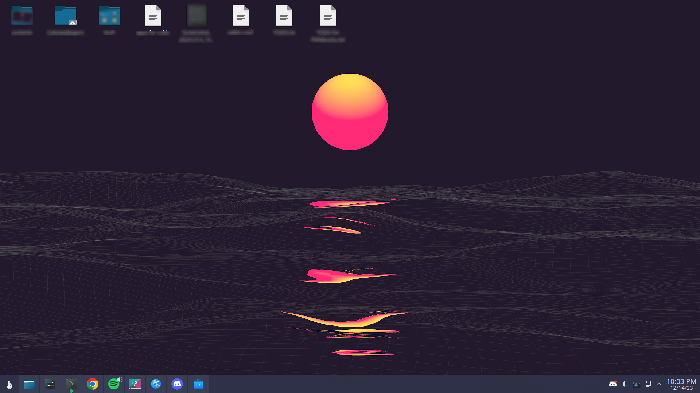

# PWNbuntu
Modified Kubuntu with useful utilities included. Perfect when you want an OS that is at the same time simple and powerful!

Included utilities:
* kio-admin
* gdebi
* Ark (archive manager)
* Spotify
* Steam
* Discord
* Tachiyomi desktop (port for manga reader app)
* Cubic (incase you want to customize the ISO how you want)
* Parsec (client for windows streaming host)
* Sunshine (if you set this up then you can connect to your pc from anywhere!)
* Free Download Manager (mainly just a torrent program, but it can accelerate downloads a bit)
* VLC
* Obs Studio
* Lutris
* VS Code
* Balena Etcher (for making bootable USBs)
* Libre Office Suite (for your general office work)
* Bundled KDE utilities like KDE Connect, Kate, Spectacle (amazing screenshot app)
* Wine was supposed to be included, however since new releases are released really often, you should download it from the official source: https://www.winehq.org/ .

# Beta testing is available for those who are interested!
If you have any suggestions then start a pull request. 
If you have any issues, use the Github Issues to notify me. > BEFORE YOU START AN ISSUE, INCLUDE RELEVANT LOGS!! <

Preview:

